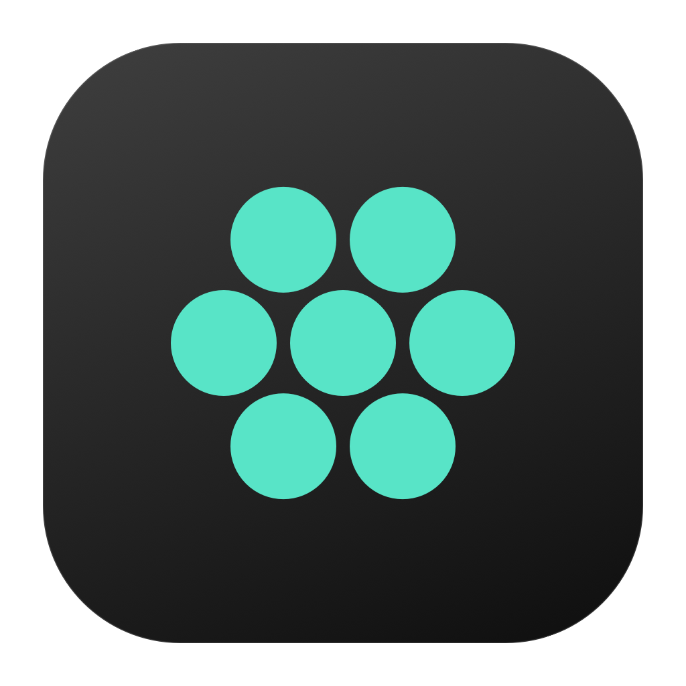
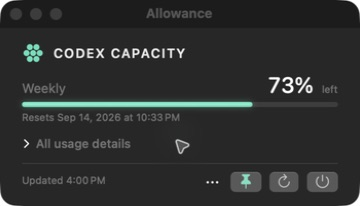
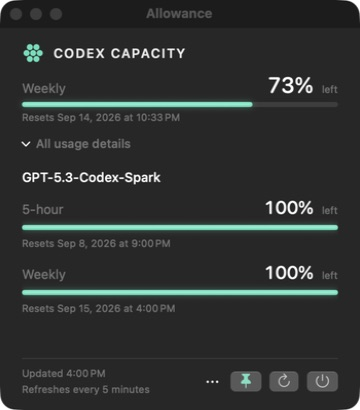

<div align="center">
  
  <h1>Allowance</h1>
  <p>Your remaining Codex allowance, at a glance.</p>
</div>

Allowance is a macOS menu-bar companion that shows your remaining Codex account allowance and reset dates. Keep its window on top, remember its position, and expand additional usage details when you need them.

**Unofficial. Not affiliated with, endorsed by, or supported by OpenAI.**



<details>
<summary>See the expanded view</summary>



</details>

The app displays only the allowance windows Codex returns for your account. Screenshots are examples from a real account; your available windows and percentages may differ.

## Download and set up Allowance

### 1. Install the app

**[Download Allowance for macOS](https://github.com/OS-DevSource/allowance/releases/latest/download/Allowance-macOS-universal.zip)**

Unzip the download, then drag **Allowance** into your Applications folder. The same download supports Apple Silicon and Intel Macs and targets macOS 13 or later. Intel hardware and macOS 13–26 have not yet been tested directly; see [verification and compatibility](docs/verification.md).

Allowance is free and open source, but this build is not yet signed with a paid Apple Developer ID or notarized. macOS will therefore block the first launch:

1. Open Allowance from Applications. When macOS says it cannot verify the developer, click **Done**.
2. Open **System Settings → Privacy & Security**.
3. Scroll to **Security**, click **Open Anyway** beside Allowance, then confirm **Open Anyway**.

This creates an exception for the app so it can open normally afterward. A newly downloaded update may require the same approval. See [Apple's guide to safely opening Mac apps](https://support.apple.com/102445) for the current system wording. Never disable Gatekeeper or paste a quarantine-removal command to install Allowance.

### 2. Connect Codex

Allowance reads usage through the official Codex CLI. Follow the [Codex CLI setup guide](https://developers.openai.com/codex/cli/), then run:

```sh
codex --version
codex login
```

Use the ChatGPT account whose allowance you want to see. Allowance uses the CLI's existing sign-in; there is no separate login inside Allowance. Installing the Codex desktop app alone does not establish that the CLI is available to Allowance.

Open Allowance from Applications. Its companion window appears and **Allowance** is added to the menu bar. After the first successful refresh, you should see your remaining allowance, reset dates, and an update time. If the CLI is not detected, choose **Setup & connection…** in Allowance, then select the Codex executable or open the linked official setup guide.

## Use Allowance

| Control | What it does |
| --- | --- |
| **All usage details** | Expands additional allowance windows, when your account reports them. |
| **Refresh** (circular arrow) | Reads the latest allowance. Automatic refresh runs every five minutes while the app is open. |
| **Keep on top** (pin) | Keeps the companion above ordinary windows. It does not put it above full-screen apps or on every Space. |
| **More options** (ellipsis) | Opens Settings or brings back the companion window. |
| **Quit Allowance** (power) | Stops the app and automatic refresh. Closing the window alone leaves the menu-bar app running. |

Reset dates use your Mac's local time zone. If a refresh fails, the last successful reading stays visible with a warning and its original update time. Missing data is not shown as a zero balance.

### Remember the window position

Open **More options → Settings**. **Remember window position** is on by default: move the companion where you want it, and it will reopen there. Expanding usage details preserves its top edge.

Turn the setting off to use the centered launch position. Turning it back on saves the current location. Positions are saved only on your Mac; if a saved display is unavailable, the app keeps the window's title bar reachable on an available display.

## Troubleshooting

| Problem | What to try |
| --- | --- |
| macOS will not open Allowance | Follow the one-time **Privacy & Security → Open Anyway** steps above. Do not disable Gatekeeper. |
| **Codex CLI was not found** | Run `command -v codex` in Terminal. In **More options → Settings → Choose Codex…**, select that executable. In the file chooser, press **Command–Shift–G** to enter its containing folder, including a hidden folder such as `~/.local/bin`. |
| The selected executable is no longer available | Choose its new location in Settings, or select **Use automatic detection**. Select the executable file, not an app bundle or folder. |
| Codex needs you to sign in again | Run `codex login` in Terminal, complete sign-in, then click Refresh in Allowance. |
| Unable to reach Codex or a request times out | Check your connection and retry Refresh. Requests time out after 25 seconds. |
| Unexpected response or no allowance windows | Check `codex --version` and your sign-in. The app depends on an experimental CLI interface; API-key-only accounts may not expose subscription allowance windows. Include your CLI version when reporting a persistent problem. |
| The companion window is closed | Click **Allowance** in the menu bar, then **More options → Open companion window**. |

Automatic detection checks `~/.local/bin/codex`, `/opt/homebrew/bin/codex`, `/usr/local/bin/codex`, and absolute directories on the app's inherited `PATH`. Finder-launched apps can have a different `PATH` from Terminal, which is why choosing the executable explicitly can help.

For unresolved problems, [open an issue](https://github.com/OS-DevSource/allowance/issues) with your macOS version, CLI version, source commit or release, and visible error message. Do not include authentication files or private logs.

## Update Allowance

Quit Allowance, download the latest app using the button above, and replace the existing copy in Applications. macOS may ask for the one-time approval again because the downloaded app has changed.

Local preferences are retained. Allowance has no automatic updater.

## Privacy and allowance use

Allowance requests account limits through the local Codex app server. Refreshing does not start a model turn or request a reset credit. Codex handles authentication and network access; Allowance adds no analytics or advertising services. See [Privacy](PRIVACY.md) for local storage and diagnostic guidance.

## Build from source

Building is optional and intended for contributors. You need Swift 6.2+ and the macOS 26+ SDK:

```sh
git clone https://github.com/OS-DevSource/allowance.git
cd allowance
./build-app.sh --release
open Allowance.app
```

Use `./build-app.sh --release --universal` for both Apple Silicon and Intel. See [Contributing](CONTRIBUTING.md) for checks and development commands, [verification notes](docs/verification.md) for coverage, and the [changelog](CHANGELOG.md) for changes.

## License

[MIT](LICENSE) © 2026 John Rodriguez.
